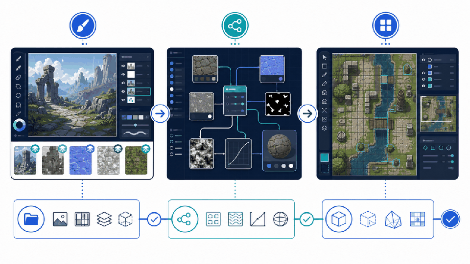

# dcc-mcp-material-maker


Material Maker adapter for the DCC Model Context Protocol ecosystem.



The adapter uses a process-isolated loopback JSON-lines bridge contract and does not
expose arbitrary source evaluation.

## Install

```bash
pip install dcc-mcp-material-maker
dcc-mcp-material-maker-install
```

Configure the Material Maker bridge endpoint, then start:

```bash
dcc-mcp-material-maker
```

The MCP endpoint defaults to `http://127.0.0.1:8767/mcp`; the plug-in bridge uses
`127.0.0.1:3848`. Override the latter with `DCC_MCP_MATERIAL MAKER_BRIDGE_PORT` before
starting both processes.

## Current tools

- Check MATERIAL MAKER bridge status and version.
- List open images with dimensions.
- Inspect the active image.

The first release targets safe session discovery. Image mutation and export will
be added only through typed MATERIAL MAKER procedures, not arbitrary source evaluation.

## Development

```bash
python -m pip install -e ".[dev]"
python -m pytest
python -m ruff check src tests tools
python tools/lint_skills.py
python -m build
python -m twine check dist/*
```

Material Maker plug-in API reference: https://developer.material_maker.org/api/3.0/
