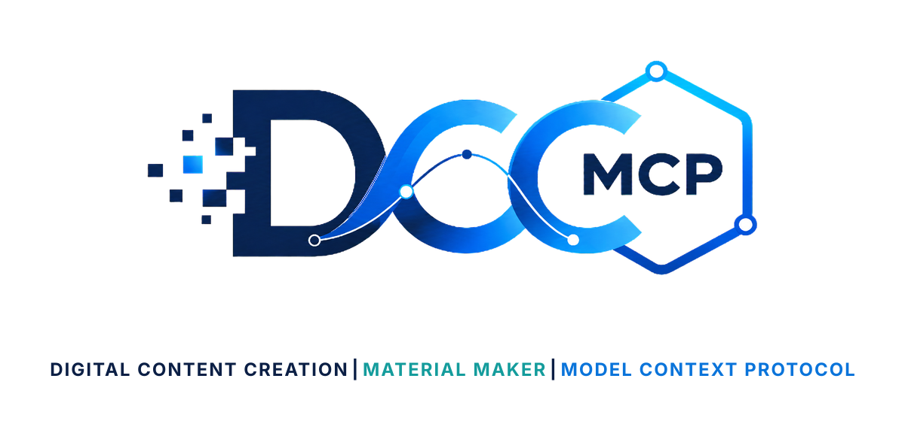
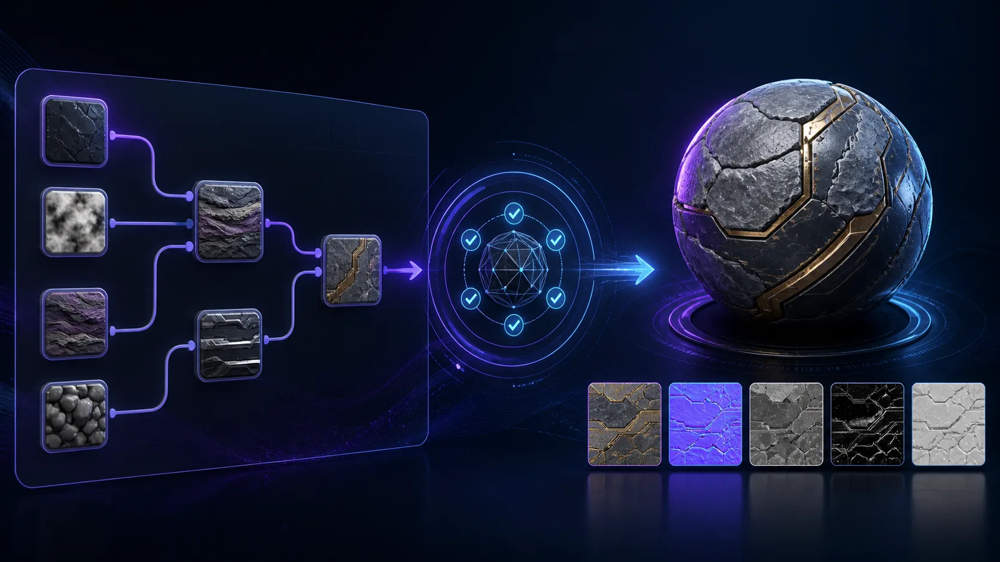

# dcc-mcp-material-maker

<p align="center">
  <picture>
    <source media="(prefers-color-scheme: dark)" srcset="docs/images/dcc-mcp-material-maker-dark.svg">
    <source media="(prefers-color-scheme: light)" srcset="docs/images/dcc-mcp-material-maker.svg">
    
  </picture>
</p>

Typed, workspace-bounded Material Maker automation for DCC-MCP.



_Illustrative workflow generated with OpenAI ImageGen from the retained source in `docs/images/sources`; it is not a Material Maker screenshot or host-validation artifact._

The adapter inspects and validates Material Maker `.ptex` graphs without launching
the editor, then uses Material Maker's documented command-line exporter for
Blender, Godot, Unity, or Unreal handoff. It is a standalone service: there is no
in-process plug-in, loopback bridge, arbitrary GDScript, shader, or shell input.

## Capabilities

| Typed tool | Contract |
| --- | --- |
| `get_status` | Load a trusted `.ptex` and require bounded transient export artifacts from the native executable. |
| `inspect_project` | Report file hash, graph/node/connection counts, material outputs, and node types. |
| `validate_project` | Check graph structure, unique node names, endpoints, ports, and configured limits. |
| `export_material` | Export one valid `.ptex` project into a new staging-backed output directory. |

Interactive graph authoring is intentionally outside this adapter's typed
contract. Use Material Maker itself when visible node editing is required.

## Requirements

- Python 3.9 or newer
- `dcc-mcp-core` 0.20.14 or newer
- Material Maker 1.7.0 or newer for native export

Follow [Installation](install.md) for the supported wheel lifecycle, three-platform
configuration, JSON verification, upgrade, uninstall, and troubleshooting contract.
The adapter wheel is not currently published to PyPI; do not treat the package name
as an available public pip install until the release artifact and Core catalog entry exist.

After installing a trusted, digest-verified wheel, point the adapter at the official
Material Maker executable, report its canonical product release, and choose a
trusted `.ptex` readiness project:

```bash
export DCC_MCP_MATERIAL_MAKER_EXECUTABLE=/opt/material-maker/material_maker
export DCC_MCP_MATERIAL_MAKER_VERSION=1.7.0
export DCC_MCP_MATERIAL_MAKER_PROBE_PROJECT=/workspace/materials/readiness.ptex
export DCC_MCP_MATERIAL_MAKER_ALLOWED_ROOTS=/workspace/materials
dcc-mcp-material-maker install --json --install-root /workspace/dcc-mcp-material-maker
# Review the schema-valid plan, then execute its exact next_steps[].command.
dcc-mcp-material-maker verify --json --install-root /workspace/dcc-mcp-material-maker
dcc-mcp-material-maker
```

On Windows, use semicolons between multiple allowed roots; on POSIX systems,
use colons. The adapter also searches common installation locations when the
executable variable is omitted.

## Safety model

- resolves projects and destinations under explicit allowed roots;
- accepts UTF-8 JSON `.ptex` projects only;
- bounds project size, graph traversal, node/connection counts, export files,
  export bytes, runtime, and captured output;
- invokes a fixed executable argument vector with `shell=False` semantics;
- supports Core cancellation and terminates timed-out child processes;
- exports into a private staging directory, rejects links and empty output,
  hashes every file, and atomically exposes only a complete new directory;
- treats process exit zero without a validated `.ptex` and nonempty bounded
  export artifacts as not ready;
- never overwrites an existing export directory.

See [Architecture](docs/architecture.md) for trust boundaries and configuration.

## Development

```bash
python -m pip install -e ".[dev]"
python -m pytest -q
python -m ruff check src tests tools
python -m ruff format --check src tests tools
python tools/lint_skills.py
python -m build
python -m twine check dist/*
```

The native exporter follows the official Material Maker command-line interface:
<https://rodzilla.itch.io/material-maker>.
